# Import Auditplus Vouchers To Tally Using TDL

* Configure
* Login
* Download Masters (Group, Voucher Type)
* Mapping Masters (Group, Voucher Type) 
* Transaction Download
* Delete imported vouchers based on date, voucher type

# Steps

* 1. Create Company
    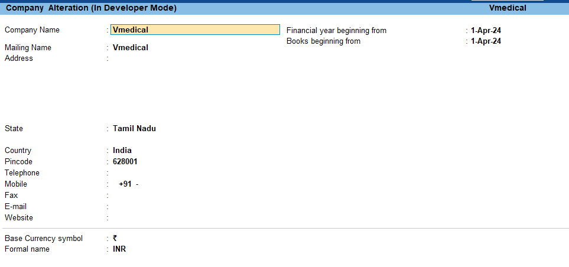
* 2. Load TDL auditplus.txt
    * F1: Help => O: TDLs & AddOns => F4: Manage Local TDLs 
    * Select Tdl from local path, and End of List
    * Ctrl+Q : Quit
* 3. Now Menu "Auditplus Integration" added in Menu "Gateway of Tally"
* 4. Configure
    * Host          : http://192.168.1.31:3000 or https://ap1.auditplusdb.com
    * Organization  : someorg
    * BookBegin:    : 1-Apr-24
    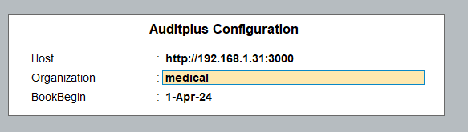
* 5. Login
    * Username      : someuser with "tally export" permission
    * Password      : somepassword
    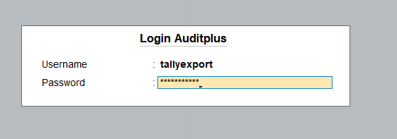
* 6. GoTo "Masters" => Select "Download"
* 7. GoTo "Group" => Map tally group against auditplus account type 
    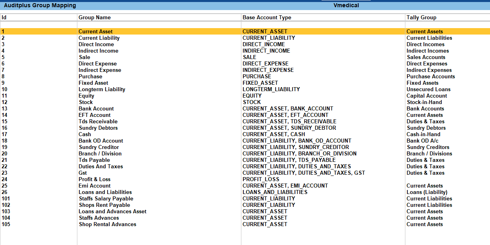
* 8. GoTo "Voucher Type" => Map tally voucher type against auditplus voucher type 
    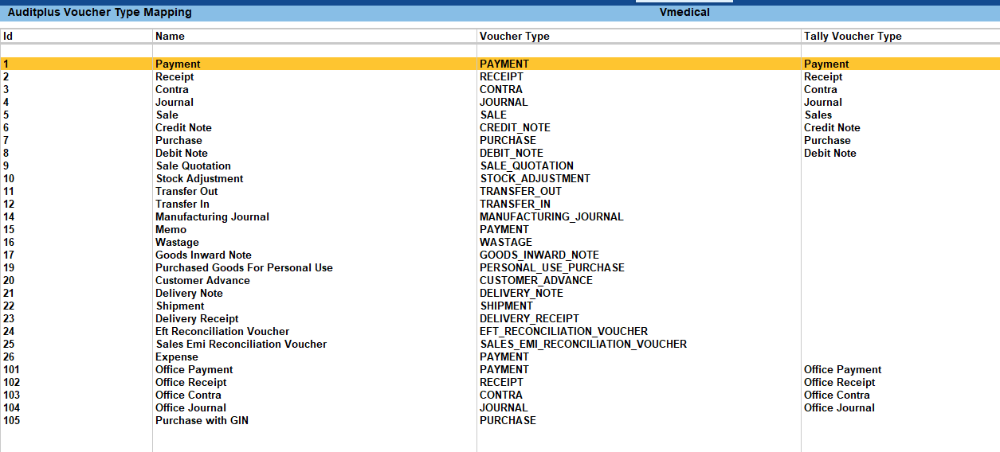
* 9. Make sure
    * "Method of Voucher Numbering"             : Automatic (Manual Override)
    * Prevent creating duplicate Voucher Nos.   : Yes
    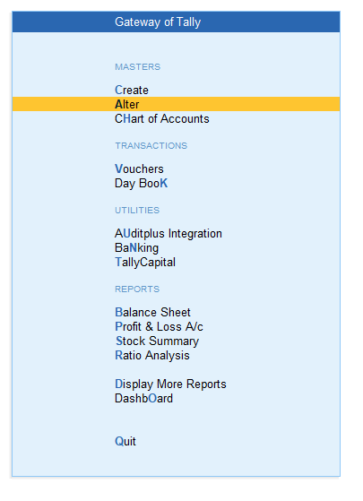
    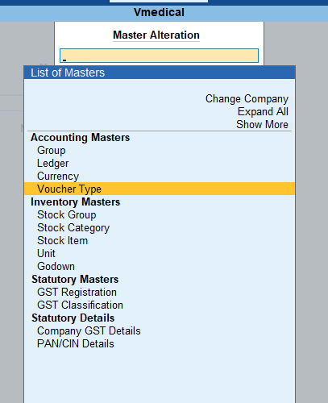
    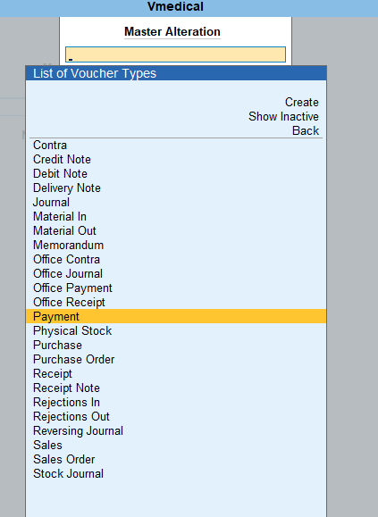
    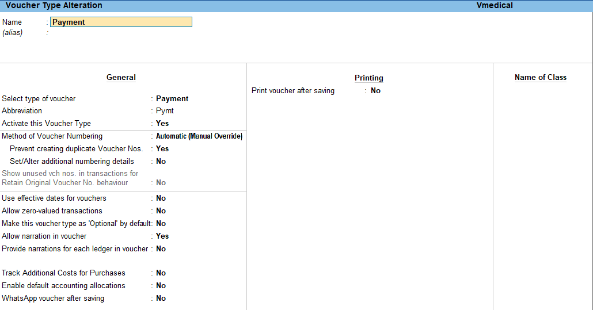
* 10. If you need any new voucher type, then create it
    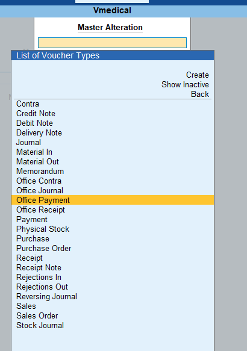
    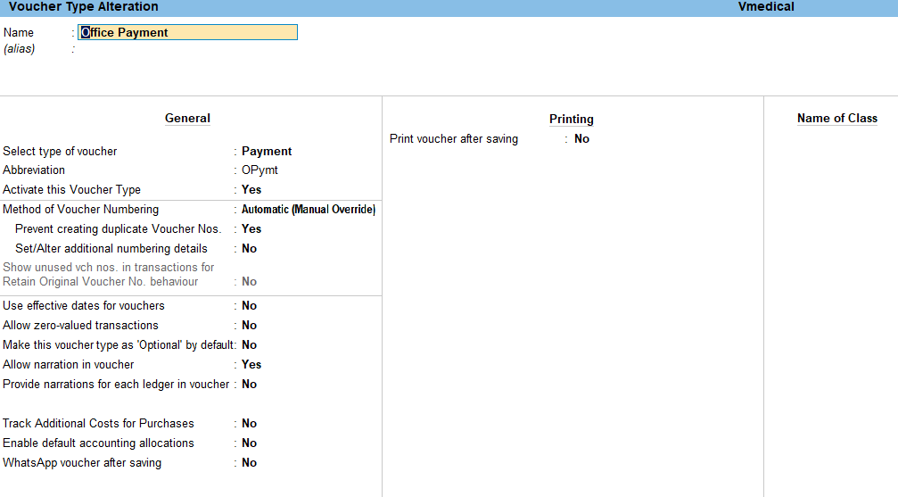
* 11. GoTo "Transactions" to download vouchers from auditplus
    
* 12. GoTo "Delete Imported Vouchers" 
    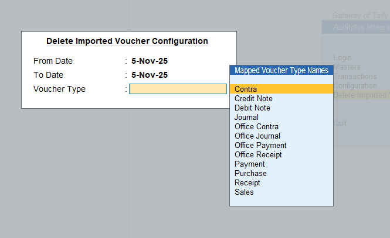